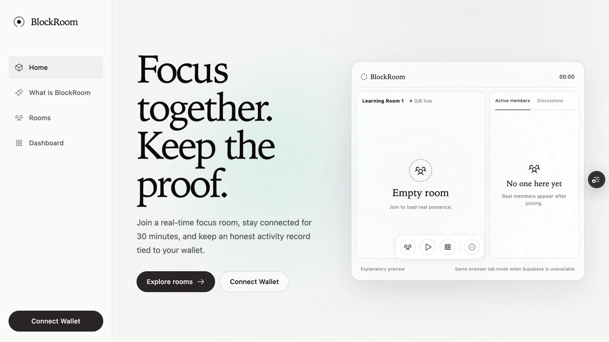
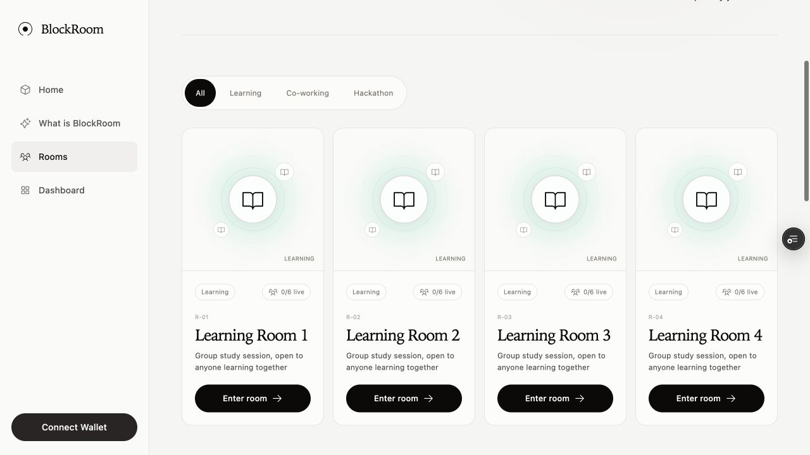
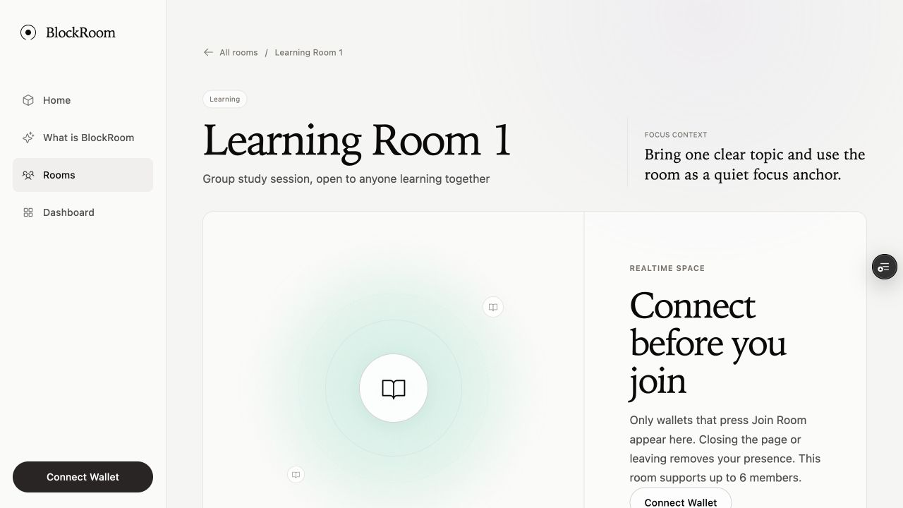
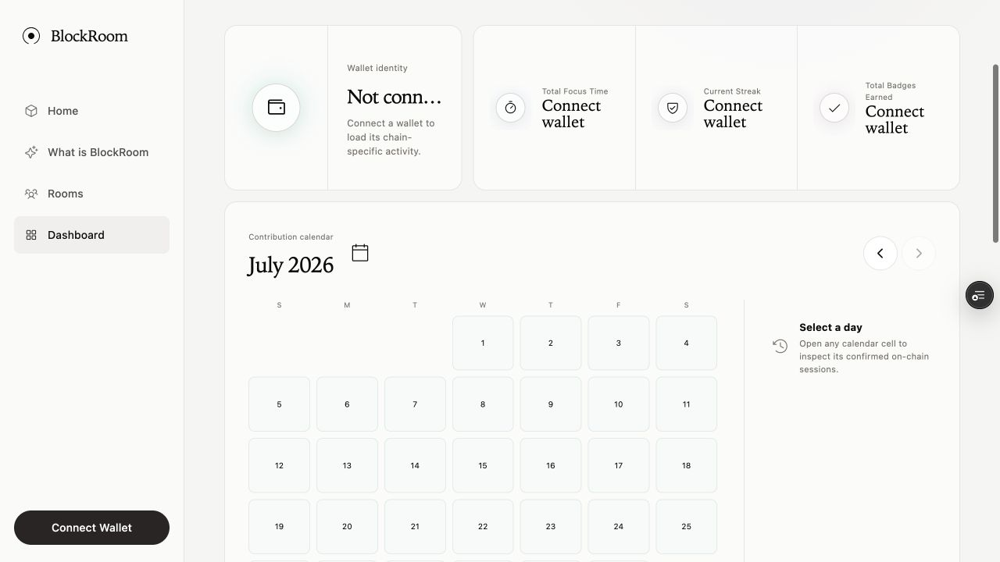

# BlockRoom

BlockRoom is a wallet-identified, real-time Web3 co-learning and co-working
space. Public Beta rooms support genuine presence, chat, microphone, webcam,
screen sharing and automatic joined-room timing without invented activity.

Public Preview: <https://blockroom-chin0312-wowwwthemaya.vercel.app>

## Product preview

These screenshots come from the deployed Public Beta. They intentionally show
truthful empty and disconnected states rather than fabricated members, chat or
on-chain activity.

<table>
  <tr>
    <td width="50%">
      <strong>Home</strong><br />
      
    </td>
    <td width="50%">
      <strong>Rooms</strong><br />
      
    </td>
  </tr>
  <tr>
    <td width="50%">
      <strong>Room</strong><br />
      
    </td>
    <td width="50%">
      <strong>Dashboard</strong><br />
      
    </td>
  </tr>
</table>

Eligible focus sessions may be recorded on a supported testnet after explicit
wallet approval. These records are wallet-signed **self-attestations**: the
contracts validate format and accounting, but cannot prove productivity or
continuous human attention.

## Public Beta networks

BlockRoom v1 supports exactly three EVM networks:

1. Monad Testnet (primary)
2. Base Sepolia
3. Ethereum Sepolia

The chain registry in `src/config/chains.ts` is the only frontend source for
chain IDs, labels, explorers, RPCs and Session/Badge contract addresses. The
Dashboard and its history are scoped to the currently connected chain.
Cross-chain aggregation is intentionally deferred until after Public Beta.

If either contract is missing on the connected chain, BlockRoom shows a clear
unavailable state. Realtime rooms remain usable and no local value is presented
as confirmed on-chain data.

## Session lifecycle

1. A successful room join creates a chain-scoped unique Session ID.
2. The timer advances from Join until Leave, refresh, close, wallet change or
   network change. Working in another browser tab still counts.
3. A visit under 30 continuous minutes is deleted and contributes nothing.
4. At 30 minutes the visit becomes locally eligible; nothing is submitted while
   the visit remains active because the final duration is not known yet.
5. Leaving freezes the exact final interval. The user can approve the Session
   transaction immediately or keep it pending for Dashboard retry.
6. Rejoining always creates a new ID and independent 30-minute threshold.
7. Only a successful transaction receipt creates a confirmed record. The
   Session contract rejects duplicate IDs.

Closing the page, rejecting a wallet request or encountering an RPC failure
does not discard an eligible Session. Pending records remain browser-local and
never affect confirmed statistics or Badge eligibility.

## Contracts

Public Beta uses two contracts per supported chain, deployed in this order:

- `BlockRoomSessions.sol` stores the submitting wallet, Session ID, hashed room
  slug, start/end timestamps, exact duration and confirmation block timestamp.
- `BlockRoomBadges.sol` reads confirmed totals from its immutable Session
  contract and issues two non-transferable ERC-1155 achievements.

Public Beta deployments on Monad Testnet, Base Sepolia and Ethereum Sepolia:

- Session: `0xBE1594148dDD4e7FF3A4ABbF47Be9a9fF2c59092`
- Badge: `0xD53C628c4859A7460b5F2Ea0885bb4Da2d9fe1d1`

The addresses are real, verified deployments and are committed in the central
chain registry. Environment variables may override them for future releases.
Per-chain transaction hashes and explorer links are recorded in
`docs/contracts.md`.

Badge types:

- **First Session** (`tokenId 1`): one confirmed eligible Session.
- **24 Hour Focus** (`tokenId 2`): 86,400 cumulative confirmed seconds.

Metadata and artwork are embedded as Base64 JSON/SVG data URIs. Each wallet may
claim each Badge once through an explicit wallet transaction. Transfers and
operator approvals revert.

Video, audio, screen sharing, chat, profile settings, realtime presence and
pending transaction state remain off-chain.

## Dashboard accounting

- Total Focus Time is the sum of confirmed Session durations on the connected
  chain.
- Completed sessions counts confirmed unique Session IDs on that chain.
- Current Streak uses local calendar days containing confirmed time.
- Sessions crossing local midnight are divided between the affected dates.
- Calendar intensity uses confirmed daily time only: zero, under 30 minutes,
  30–59 minutes, 1–2 hours, 2–4 hours and more than 4 hours.
- The legacy `blockroom-activity-v2` store remains read-only and never affects
  chain totals or NFTs.

## Local development

```bash
npm install
cp .env.example .env.local
npm run dev
```

Populate only values you actually control. `.env.local` is ignored by Git.
`NEXT_PUBLIC_` values are public and embedded at build time; private keys and
verification credentials must never use that prefix.

Required for a public Preview:

- `NEXT_PUBLIC_REOWN_PROJECT_ID`
- `NEXT_PUBLIC_APP_URL`
- `NEXT_PUBLIC_SUPABASE_URL`
- `NEXT_PUBLIC_SUPABASE_PUBLISHABLE_KEY`

Optional public RPC and contract overrides are documented in `.env.example`.
Without Supabase, BlockRoom explicitly falls back to `Same-browser tab mode`,
which is not sufficient for external multi-browser testing.

## Contract development

```bash
npm run contracts:compile
npm run contracts:test
npm run test
npm run test:room-realtime
```

The production threshold remains 1,800 seconds. Automated tests simulate
timestamps instead of adding a shortened production path. The Realtime smoke
test uses only the disposable test-wallet addresses derived inside a Node
process; keys never enter the browser bundle or command line. It verifies six
unique participants, seventh-wallet cleanup, same-wallet multi-session retention
and released-slot replacement against an isolated Supabase Presence topic.

### Deploy a supported chain

Deployment requires a funded testnet wallet. Keep the private key only in the
current shell or ignored `.env.local`:

Place `BLOCKROOM_DEPLOYER_PRIVATE_KEY` in ignored `.env.local`, then run:

```bash
npx hardhat --network monadTestnet --build-profile production ignition deploy ignition/modules/BlockRoom.ts
npx hardhat --network baseSepolia --build-profile production ignition deploy ignition/modules/BlockRoom.ts
npx hardhat --network ethereumSepolia --build-profile production ignition deploy ignition/modules/BlockRoom.ts
```

Each Ignition deployment creates `BlockRoomSessions` first and then
`BlockRoomBadges` with the Session address as its constructor argument. Record
only the real resulting addresses in the corresponding `NEXT_PUBLIC_*`
variables and rebuild the frontend.

Verify each contract only after deployment:

Place `ETHERSCAN_API_KEY` in ignored `.env.local`, then run:

```bash
npx hardhat --network <network> --build-profile production verify <session-address>
npx hardhat --network <network> --build-profile production verify <badge-address> <session-address>
```

The current real addresses, transaction hashes, explorer links and verification
status are in `docs/contracts.md`.

## Release verification

```bash
npm run lint
npx tsc --noEmit
npm run test
npm run test:room-realtime
npm run contracts:test
npm run build
```

After each real chain deployment, manually verify short Session rejection,
eligible Session submission, wallet rejection and retry, duplicate prevention,
Dashboard reconciliation, both Badge gates, chain switching and explorer links.

## Preview deployment

The Preview build requires a linked Vercel project and the public environment
variables above. Contract deployment keys and explorer API keys do not belong
in Vercel. Build-time public variables must be configured before creating the
Preview because Next.js inlines them into the client bundle.

The stable Public Beta Preview is
<https://blockroom-chin0312-wowwwthemaya.vercel.app>. Vercel Authentication is
disabled for this project so external testers can open it without a Vercel
account. Real-wallet transaction, realtime multi-browser and media checks must
be performed with genuine devices and wallet approvals.

## AI assistance and manual review

AI assisted with contract scaffolding, tests, frontend integration and release
documentation. The product rules, supported networks, 30-minute threshold,
self-attestation language, visual direction and no-fabrication requirements
were supplied or approved manually. Contract deployments, environment values,
wallet approvals, explorer verification and final Preview acceptance require
manual authorization and review.

## References

- [`docs/project-blueprint.md`](docs/project-blueprint.md) — creator blueprint for the product model, truthful-state rules, architecture and component responsibilities.
- [`docs/contracts.md`](docs/contracts.md) — contract architecture, deployed addresses, transaction hashes and Viem examples.
- [`docs/design-references/elevenlabs/DESIGN.md`](docs/design-references/elevenlabs/DESIGN.md) — retained visual-system reference.
- [`docs/design-references/Generated image 3.png`](docs/design-references/Generated%20image%203.png) — selected visual direction.
