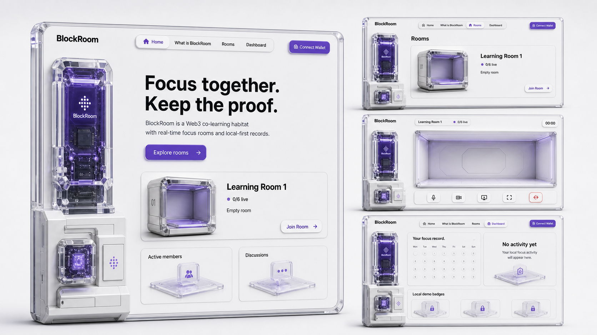
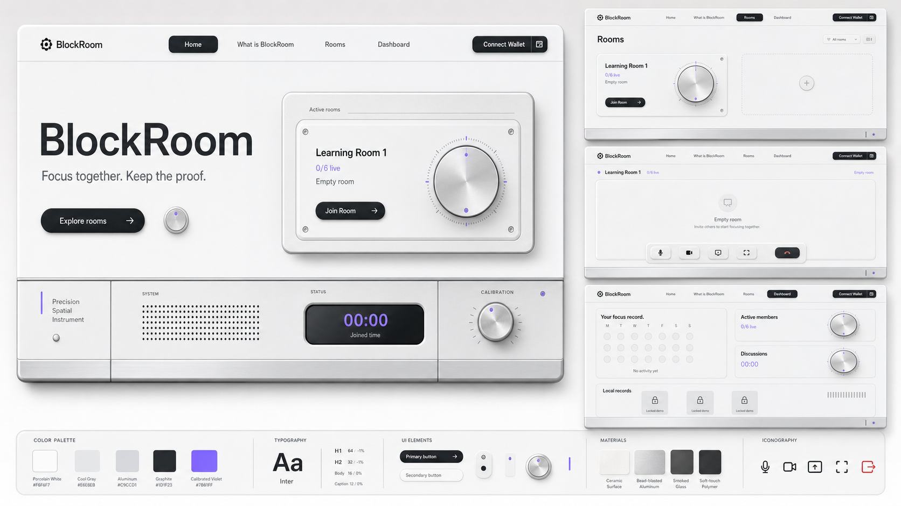
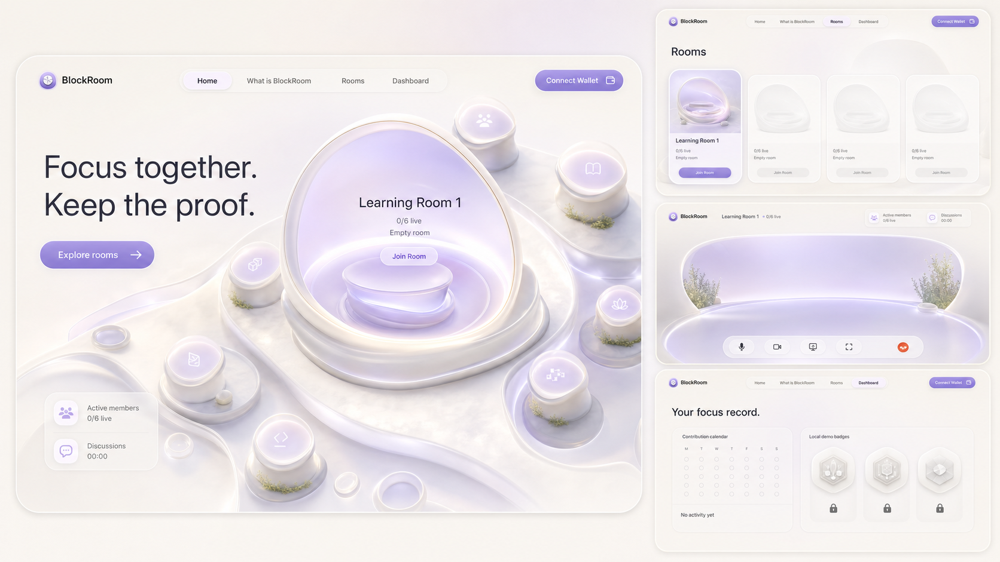

# BlockRoom Visual Refactor Concept Prompts

These prompts are derived from `docs/project-blueprint.md`. They intentionally
use the same product content, screen arrangement, and honest empty state so the
only meaningful comparison is visual language.

## Shared comparison frame

- High-fidelity, shippable desktop web UI mockup, not concept art.
- 16:9 landscape product design board.
- One large BlockRoom Home screen plus three supporting screens: Rooms, an empty
  Learning Room 1 workspace, and Dashboard.
- Use only honest disconnected or empty state. No fabricated people, avatars,
  chat, activity, social proof, course content, wallet balances, tokens, NFTs,
  payments, or transactions.
- Preserve the visible product controls needed for comparison: navigation,
  Connect Wallet, room filters, `0/6 live`, room join gate, meeting controls,
  contribution calendar, and signed demo badge area.
- Light mode only. No dark cyberpunk, neon, exchange UI, generic SaaS template,
  decorative diagonal stripes, slash overlays, watermarks, or unrelated logos.

## Concept 01: Crystal Protocol Habitat



```text
Use case: ui-mockup
Asset type: 16:9 full-product visual direction board for a desktop Web3 co-learning application
Primary request: Design a high-fidelity, implementation-ready UI system for BlockRoom called “Crystal Protocol Habitat”. The product uses a connected wallet as identity, offers real-time six-person focus rooms, and stores eligible focus activity locally. Make the visual language feel like a premium physical Web3 protocol habitat, not a SaaS dashboard.
Scene/backdrop: cold off-white spatial canvas with generous margins, quiet atmospheric depth, and no scenery or people
Subject: one large BlockRoom Home browser screen occupying roughly sixty percent of the board, plus three smaller coordinated screens for Rooms, an empty Learning Room 1 meeting workspace, and Dashboard
Style/medium: realistic high-end product UI mockup with original three-dimensional hardware modules; high-refractive clear crystal shells, thick white ceramic slabs, translucent violet compute chambers, visible inner chips, precise Z-axis stacking, attached side walls, soft contact shadows, and restrained violet light transmission
Composition/framing: orthographic three-quarter product perspective inside the UI illustrations while the application layout stays straight and practical; floating capsule navigation; confident editorial typography; broad whitespace; large destination cards; meeting controls remain immediately reachable
Lighting/mood: cool studio daylight, calm, precise, premium, focused
Color palette: cold white, pearl silver, near-black, restrained violet signal, tiny green status signal only when semantically required
Materials/textures: high-refractive crystal, polished ceramic, translucent violet resin, subtle anodized aluminum, crisp hairline borders
Text (verbatim): “BlockRoom”, “Home”, “What is BlockRoom”, “Rooms”, “Dashboard”, “Connect Wallet”, “Focus together. Keep the proof.”, “Explore rooms”, “Learning Room 1”, “0/6 live”, “Empty room”, “Join Room”, “Active members”, “Discussions”, “00:00”, “Your focus record.”, “No activity yet”
Constraints: render BlockRoom text exactly; show only 0/6 live and empty states; the room must contain no participant tile pretending to be a user; show meeting control shapes for microphone, webcam, screen share, fullscreen, and leave; show a zero-state contribution calendar and locked local demo badges; all four screens must use the same component, icon, radius, material, spacing, and typography system; geometric perspective edges are allowed but no decorative diagonal stripes or slash overlays
Avoid: flat icon-only card centers, disconnected floating strips, glass rectangles without physical thickness, fake users, avatars, chat messages, positive metrics, course thumbnails, token balances, wallet assets, transfer or swap controls, NFT mint claims, dark mode, neon cyberpunk, crypto exchange patterns, generic Tailwind cards, excessive gradients, watermark
```

## Concept 02: Precision Spatial Instrument



```text
Use case: ui-mockup
Asset type: 16:9 full-product visual direction board for a desktop Web3 co-learning application
Primary request: Design a high-fidelity, implementation-ready UI system for BlockRoom called “Precision Spatial Instrument”. Treat the application as a calm premium focus instrument: wallet identity, real-time rooms, exact joined time, and local records are expressed through precise controls and physical instrument panels rather than decorative blockchain imagery.
Scene/backdrop: warm-cool porcelain white field with spacious architectural margins and a very subtle neutral horizon glow
Subject: one large BlockRoom Home browser screen occupying roughly sixty percent of the board, plus three smaller coordinated screens for Rooms, an empty Learning Room 1 meeting workspace, and Dashboard
Style/medium: realistic premium consumer-product UI; monolithic ceramic-white surfaces, bead-blasted silver aluminum rails, smoked translucent glass windows, graphite typography, inset controls, tactile black pill buttons, small violet calibration indicators, understated three-dimensional depth
Composition/framing: rigorous editorial grid, oversized typography balanced by quiet whitespace, fewer but larger surfaces, compact floating navigation, room cards composed like precision devices, room workspace fits a laptop viewport, Dashboard feels like a personal instrument panel rather than admin software
Lighting/mood: soft overcast studio light, controlled reflections, confident and quiet, highly legible
Color palette: porcelain white, cool gray, graphite black, brushed silver, one muted violet calibration color
Materials/textures: fine ceramic, bead-blasted aluminum, smoked glass, soft-touch polymer, engraved micro-labels used sparingly
Text (verbatim): “BlockRoom”, “Home”, “What is BlockRoom”, “Rooms”, “Dashboard”, “Connect Wallet”, “Focus together. Keep the proof.”, “Explore rooms”, “Learning Room 1”, “0/6 live”, “Empty room”, “Join Room”, “Active members”, “Discussions”, “00:00”, “Your focus record.”, “No activity yet”
Constraints: render BlockRoom text exactly; show only 0/6 live and empty states; no people or fabricated participant tiles; meeting controls for microphone, webcam, screen share, fullscreen, and leave must remain understandable; show a zero-state contribution calendar and locked local demo badges; all screens share one exact design system; depth comes from attached material layers, inset wells, shadows, and highlights, never from arbitrary skewed cards; no decorative diagonal stripes or slash overlays
Avoid: transparent crystal as the dominant material, floating sci-fi networks, fake users, avatars, chat messages, positive metrics, wallet balances, payment actions, NFT mint claims, trading-terminal density, colorful gradients, dark mode, neon, enterprise dashboard chrome, generic SaaS cards, watermark
```

## Concept 03: Ambient Network Atelier



```text
Use case: ui-mockup
Asset type: 16:9 full-product visual direction board for a desktop Web3 co-learning application
Primary request: Design a high-fidelity, implementation-ready UI system for BlockRoom called “Ambient Network Atelier”. Present Web3 co-learning as entering a serene shared digital atelier made of spatial focus zones. The experience should feel welcoming and consumer-grade while remaining honest, technical enough to trust, and free of classroom photography or blockchain trading clichés.
Scene/backdrop: luminous ivory spatial field with quiet pools of pale lavender light and generous breathing room; no literal room photograph and no people
Subject: one large BlockRoom Home browser screen occupying roughly sixty percent of the board, plus three smaller coordinated screens for Rooms, an empty Learning Room 1 meeting workspace, and Dashboard
Style/medium: realistic premium product UI with original soft three-dimensional spatial modules; floating rounded focus pods, translucent membrane layers, frosted pearl shells, softly illuminated inner zones, gentle orbital composition without drawn network lines, and subtle ambient depth
Composition/framing: asymmetrical but balanced editorial layout; the Home screen feels like an entrance into a digital space; room cards feel like distinct destinations; the meeting workspace uses a clear empty central stage with controls close at hand; Dashboard reads as a calm personal memory surface rather than a grid of admin cards
Lighting/mood: diffuse morning light, quiet lavender ambience, restorative, human, focused, optimistic without being playful
Color palette: luminous ivory, pearl, soft platinum, pale lavender, near-black text, minimal violet and green semantic signals
Materials/textures: frosted polymer, satin ceramic, translucent membrane, diffused light, very soft grounded shadows
Text (verbatim): “BlockRoom”, “Home”, “What is BlockRoom”, “Rooms”, “Dashboard”, “Connect Wallet”, “Focus together. Keep the proof.”, “Explore rooms”, “Learning Room 1”, “0/6 live”, “Empty room”, “Join Room”, “Active members”, “Discussions”, “00:00”, “Your focus record.”, “No activity yet”
Constraints: render BlockRoom text exactly; show only 0/6 live and empty states; no people, avatar placeholders presented as real members, or sample chat; meeting controls for microphone, webcam, screen share, fullscreen, and leave remain practical; show a zero-state contribution calendar and locked local demo badges; all four screens use the same spatial pod, radius, typography, icon, spacing, and motion language; communicate connection through proximity and light, not decorative lines; no diagonal stripes or slash overlays
Avoid: hard-edged crystal chip stacks, industrial instrument panels, fake users, chat messages, positive metrics, wallet balances, transaction controls, NFT mint claims, classroom photography, metaverse characters, dark mode, neon cyberpunk, trading UI, admin dashboard density, generic Tailwind cards, watermark
```
